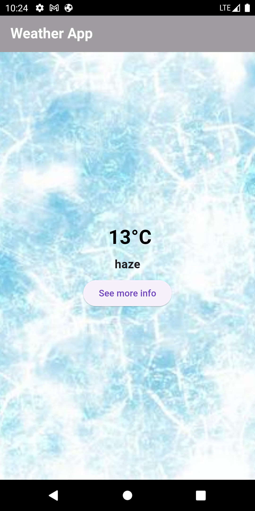
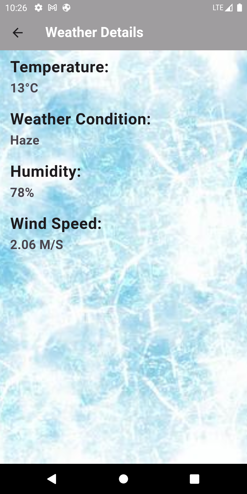

# Weather App

Weather App is a Flutter application that provides real-time weather information based on the user's current location. It uses GetX for state management, Dio for API calls, and follows clean code and architectural principles.

## Project Structure

The project structure follows a modular approach to maintain clean and organized code. Here's an overview of the main directories:

- **lib**: Contains the main Dart code for the application.
  - **controller**: Contains the controllers responsible for managing the state of the app.
  - **view**: Contains the UI components of the app, including screens and widgets.
  - **constants**: Contains constants and utility functions.
  - **api**: Contains API-related code, such as API services and repositories.
  - **assets**: Contains static assets like images.

## Architecture

The app follows the GetX architecture for state management. Here's a breakdown of the main architectural components:

- **View**: Responsible for presenting the UI to the user. It observes changes in the state and updates accordingly.

- **Controller**: Manages the state of the application. Uses GetX for reactive programming and handles business logic.

- **Model**: Represents the data structures used in the app, such as weather details.

- **API Service**: Handles communication with the OpenWeatherMap API using Dio.

- **Repository**: Acts as a bridge between the API Service and the Controller, providing a clean interface to fetch weather data.

## Screenshots




## Getting Started

To run the Weather App locally, follow these steps:

1. Clone the repository:

   ```bash
   git clone https://github.com/your-username/weather-app.git
   ```

2. Navigate to the project directory:

   ```bash
   cd weather-app
   ```

3. Install dependencies:

   ```bash
   flutter pub get
   ```

4. Run the app:

   ```bash
   flutter run
   ```

## Dependencies

- [GetX](https://pub.dev/packages/get): State management library.
- [Dio](https://pub.dev/packages/dio): HTTP client for API calls.
- [Location](https://pub.dev/packages/location): Flutter plugin for accessing device location.
